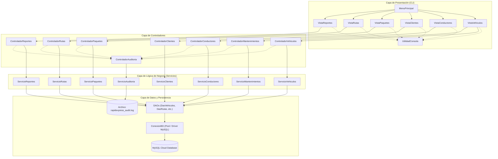
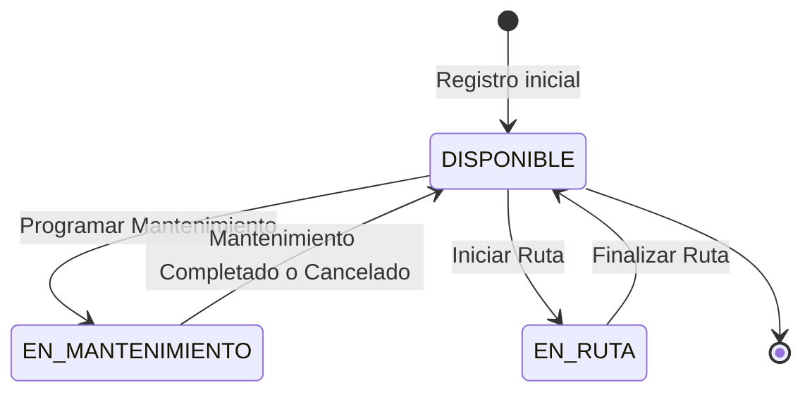
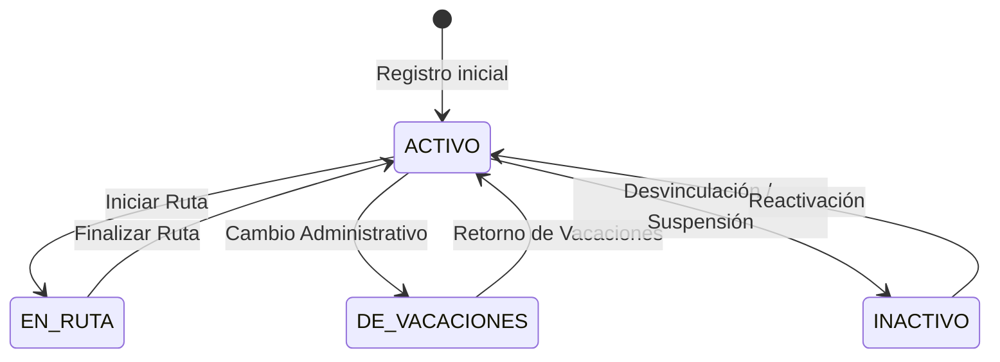
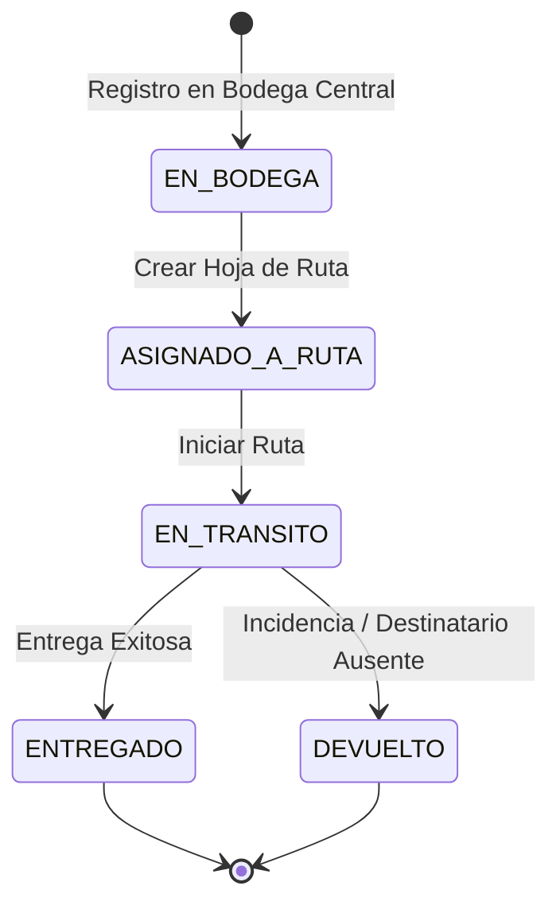
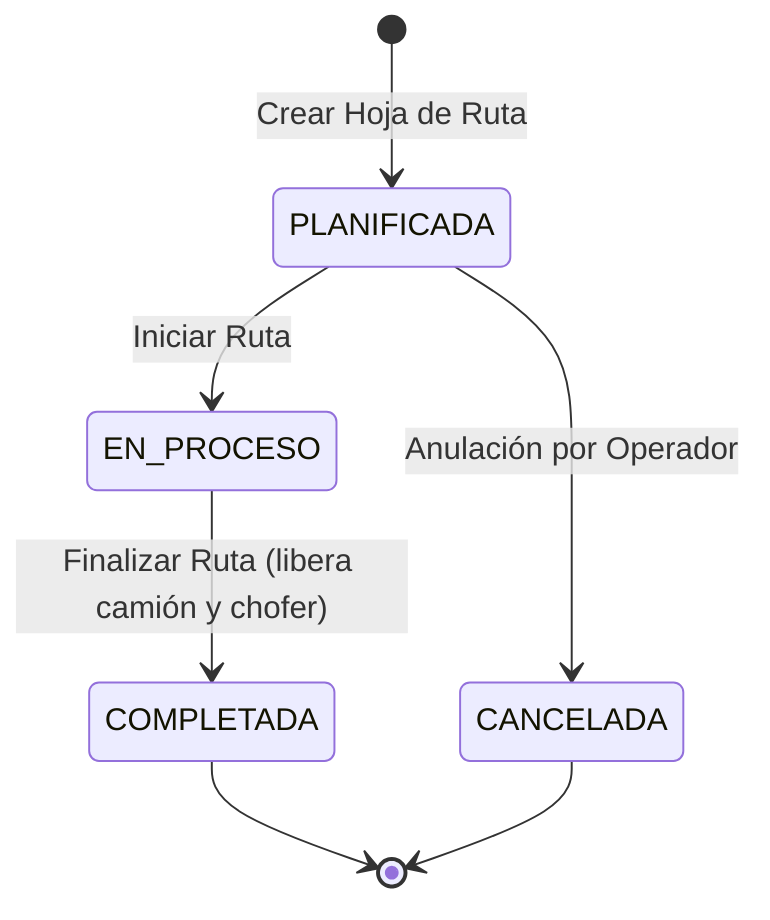

# 📖 RapidExpress — Wiki y Guía de Uso del Sistema CLI (Terminal)

> **Sistema de Información y Gestión Logística de Backend**  
> *Operación de Flotas, Conductores, Paquetería, Rutas de Distribución y Auditoría mediante Interfaz de Línea de Comandos (CLI).*

---

## 📑 Tabla de Contenidos (Wiki Funcional)

- [1. Introducción y Arquitectura del Sistema](#1-introducción-y-arquitectura-del-sistema)
  - [1.1. Propósito y Alcance](#11-propósito-y-alcance)
  - [1.2. Arquitectura Modelo-Vista-Controlador (MVC)](#12-arquitectura-modelo-vista-controlador-mvc)
  - [1.3. Mecanismo de Entrada y Salida por Consola](#13-mecanismo-de-entrada-y-salida-por-consola)
  - [1.4. Sistema de Auditoría Centralizada (`rapidexpress_audit.log`)](#14-sistema-de-auditoría-centralizada-rapidexpress_auditlog)
- [2. Requisitos Previos y Puesta en Marcha](#2-requisitos-previos-y-puesta-en-marcha)
  - [2.1. Requisitos de Software](#21-requisitos-de-software)
  - [2.2. Preparación de la Base de Datos MySQL](#22-preparación-de-la-base-de-datos-mysql)
  - [2.3. Configuración de Credenciales (`db.properties`)](#23-configuración-de-credenciales-dbproperties)
  - [2.4. Compilación y Ejecución desde la Terminal](#24-compilación-y-ejecución-desde-la-terminal)
- [3. Estructura y Navegación del Menú Principal](#3-estructura-y-navegación-del-menú-principal)
  - [3.1. Mapa de Navegación del CLI](#31-mapa-de-navegación-del-cli)
  - [3.2. Reglas de Interacción de la Consola](#32-reglas-de-interacción-de-la-consola)
- [4. Manual Funcional Módulo por Módulo](#4-manual-funcional-módulo-por-módulo)
  - [4.1. Módulo 1: Gestión de Vehículos y Mantenimientos](#41-módulo-1-gestión-de-vehículos-y-mantenimientos)
    - [4.1.1. Registrar Vehículo](#411-registrar-vehículo)
    - [4.1.2. Listar Vehículos](#412-listar-vehículos)
    - [4.1.3. Buscar Vehículo por Placa](#413-buscar-vehículo-por-placa)
    - [4.1.4. Actualizar Datos de Vehículo](#414-actualizar-datos-de-vehículo)
    - [4.1.5. Actualizar Estado de Vehículo](#415-actualizar-estado-de-vehículo)
    - [4.1.6. Programar Mantenimiento](#416-programar-mantenimiento)
    - [4.1.7. Actualizar Estado de Mantenimiento](#417-actualizar-estado-de-mantenimiento)
    - [4.1.8. Consultar Historial de Mantenimientos](#418-consultar-historial-de-mantenimientos)
  - [4.2. Módulo 2: Gestión de Conductores y Personal](#42-módulo-2-gestión-de-conductores-y-personal)
    - [4.2.1. Registrar Conductor](#421-registrar-conductor)
    - [4.2.2. Listar Conductores](#422-listar-conductores)
    - [4.2.3. Buscar Conductor por Identificación](#423-buscar-conductor-por-identificación)
    - [4.2.4. Actualizar Datos de Conductor](#424-actualizar-datos-de-conductor)
    - [4.2.5. Actualizar Estado de Conductor](#425-actualizar-estado-de-conductor)
    - [4.2.6. Asignar Vehículo a Conductor](#426-asignar-vehículo-a-conductor)
  - [4.3. Módulo 3: Gestión de Clientes (Remitentes / Destinatarios)](#43-módulo-3-gestión-de-clientes-remitentes--destinatarios)
    - [4.3.1. Registrar / Buscar Cliente](#431-registrar--buscar-cliente)
  - [4.4. Módulo 4: Gestión de Paquetes y Envíos](#44-módulo-4-gestión-de-paquetes-y-envíos)
    - [4.4.1. Registrar Nuevo Paquete](#441-registrar-nuevo-paquete)
    - [4.4.2. Buscar Paquete por Tracking ID](#442-buscar-paquete-por-tracking-id)
    - [4.4.3. Consultar Trazabilidad de un Paquete](#443-consultar-trazabilidad-de-un-paquete)
    - [4.4.4. Listar Paquetes en Bodega](#444-listar-paquetes-en-bodega)
  - [4.5. Módulo 5: Planificación y Seguimiento de Rutas](#45-módulo-5-planificación-y-seguimiento-de-rutas)
    - [4.5.1. Crear Hoja de Ruta Diaria](#451-crear-hoja-de-ruta-diaria)
    - [4.5.2. Iniciar Ruta de Despacho](#452-iniciar-ruta-de-despacho)
    - [4.5.3. Registrar Entrega de Paquete](#453-registrar-entrega-de-paquete)
    - [4.5.4. Finalizar Ruta](#454-finalizar-ruta)
    - [4.5.5. Listar Rutas Activas](#455-listar-rutas-activas)
    - [4.5.6. Ver Detalle de Entregas de una Ruta](#456-ver-detalle-de-entregas-de-una-ruta)
  - [4.6. Módulo 6: Generación de Reportes](#46-módulo-6-generación-de-reportes)
    - [4.6.1. Reporte de Entregas por Conductor en Rango de Fechas](#461-reporte-de-entregas-por-conductor-en-rango-de-fechas)
    - [4.6.2. Historial de Rutas por Vehículo](#462-historial-de-rutas-por-vehículo)
- [5. Diagramas y Máquinas de Estados](#5-diagramas-y-máquinas-de-estados)
  - [5.1. Ciclo de Vida del Vehículo](#51-ciclo-de-vida-del-vehículo)
  - [5.2. Ciclo de Vida del Conductor](#52-ciclo-de-vida-del-conductor)
  - [5.3. Ciclo de Vida del Paquete](#53-ciclo-de-vida-del-paquete)
  - [5.4. Ciclo de Vida de la Hoja de Ruta](#54-ciclo-de-vida-de-la-hoja-de-ruta)
- [6. Tutorial Operativo Extremo a Extremo (Paso a Paso)](#6-tutorial-operativo-extremo-a-extremo-paso-a-paso)
- [7. Diagnóstico y Resolución de Problemas (Troubleshooting)](#7-diagnóstico-y-resolución-de-problemas-troubleshooting)

---

## 1. Introducción y Arquitectura del Sistema

### 1.1. Propósito y Alcance
**RapidExpress** es una plataforma centralizada de gestión logística diseñada para resolver los desafíos de asignación de carga, control de flota, seguimiento de envíos y auditoría operativa. Todo el sistema se gestiona a través de una **interfaz de línea de comandos (CLI)**, garantizando tiempos de respuesta mínimos, bajo consumo de recursos y alta fiabilidad en entornos de producción y servidores.

### 1.2. Arquitectura Modelo-Vista-Controlador (MVC)
El sistema implementa una separación estricta de responsabilidades en capas desacopladas:



### 1.3. Mecanismo de Entrada y Salida por Consola
La clase `UtilidadConsola` centraliza la interacción con el usuario mediante `java.util.Scanner`:
- **`leerTexto(mensaje)`**: Captura cadenas de texto sin espacios en blanco residuales (`trim()`).
- **`leerEntero(mensaje)`**: Captura números enteros con ciclo de reintento automático y validación ante `NumberFormatException`.
- **`leerDouble(mensaje)`**: Captura importes o pesos decimales con control de errores.
- **`mostrarMenu(titulo, opciones)`**: Renderiza menús normalizados con numeración `1..N` y la opción unificada `0) Salir / Volver`.
- **`limpiarConsola()`**: Emite un desplazamiento controlado de pantalla para mantener la visibilidad limpia.
- **`pausar()`**: Detiene la ejecución hasta presionar `Enter`, permitiendo al operador examinar los resultados antes de refrescar el menú.

### 1.4. Sistema de Auditoría Centralizada (`rapidexpress_audit.log`)
Cada acción crítica realizada en el CLI genera una entrada persistente en el archivo `rapidexpress_audit.log` (ubicado en el directorio de ejecución). Las líneas siguen el formato estándar:

```text
[yyyy-MM-dd HH:mm:ss] [MODULO: <MODULO>] [ACCION: <ACCION>] [User: SISTEMA] - <Detalle del evento>
```

> [!NOTE]
> Las operaciones auditadas incluyen: creación de vehículos, cambios de estado, asignación de conductores, programación y culminación de mantenimientos, creación de paquetes, apertura de hojas de ruta, registro de entregas/devoluciones y cierre final de rutas.

---

## 2. Requisitos Previos y Puesta en Marcha

### 2.1. Requisitos de Software
- **Java Development Kit (JDK)**: Versión 17 o superior.
- **Apache Maven**: Versión 3.8.0 o superior.
- **MySQL Server**: Versión 8.0+ (Local o Instancia en la Nube: AWS RDS, Azure Database, GCP Cloud SQL, Clever Cloud, etc.).
- **Terminal compatible**: PowerShell, CMD, Git Bash, Linux Bash o macOS Terminal con soporte para codificación UTF-8.

### 2.2. Preparación de la Base de Datos MySQL
Antes de iniciar el sistema, se deben ejecutar los scripts DDL y DML situados en la carpeta `database/`:

1. Conéctate a tu servidor MySQL:
   ```bash
   mysql -h TU_HOST -P 3306 -u TU_USUARIO -p
   ```
2. Ejecuta el script de estructura de tablas:
   ```sql
   source database/1_schema_ddl.sql;
   ```
3. Ejecuta el script de datos iniciales (semilla):
   ```sql
   source database/2_data_dml.sql;
   ```

### 2.3. Configuración de Credenciales (`db.properties`)
El archivo de conexión `ConexionBD` lee los parámetros de acceso desde el archivo `db.properties` ubicado en la raíz del submódulo `RapidExpress/RapidExpress/` (al mismo nivel que `pom.xml`).

1. Copia la plantilla de ejemplo:
   ```bash
   # En Windows PowerShell
   Copy-Item "RapidExpress/RapidExpress/db.properties.example" "RapidExpress/RapidExpress/db.properties"
   ```
2. Edita `db.properties` con tus credenciales reales (sin comillas alrededor de los valores):
   ```properties
   DB_URL=jdbc:mysql://rapidexpress-db.midominio.com:3306/rapidexpress_db?useSSL=false&serverTimezone=UTC&allowPublicKeyRetrieval=true
   DB_USER=usuario_rapidexpress
   DB_PASSWORD=ContraseñaSegura2026!
   ```

> [!CAUTION]
> El archivo `db.properties` se encuentra listado en `.gitignore`. **Nunca** debe versionarse ni subirse a repositorios públicos o compartidos.

### 2.4. Compilación y Ejecución desde la Terminal

#### Opción A: Ejecución Directa mediante Plugin de Maven (Recomendada para Desarrollo)
Abre la terminal en la carpeta donde reside el `pom.xml` (`RapidExpress/RapidExpress`):

```powershell
# 1. Navegar al directorio del proyecto Maven
cd "RapidExpress/RapidExpress"

# 2. Compilar el proyecto y descargar dependencias
mvn clean compile

# 3. Ejecutar la aplicación en consola interactiva
mvn exec:java
```

> [!TIP]
> Dado que `pom.xml` define `<exec.mainClass>vistas.MenuPrincipal</exec.mainClass>`, el comando `mvn exec:java` arranca automáticamente el menú interactivo sin necesidad de especificar flags adicionales.

#### Opción B: Empaquetado JAR y Ejecución Nativa de Java (Producción)
```powershell
# 1. Generar el empaquetado JAR
mvn clean package

# 2. Ejecutar con el classpath de dependencias incluido
java -cp "target/RapidExpress-1.0-SNAPSHOT.jar;target/dependency/*" vistas.MenuPrincipal
```
*(En Linux/macOS sustituir `;` por `:` en el classpath).*

---

## 3. Estructura y Navegación del Menú Principal

### 3.1. Mapa de Navegación del CLI

```text
==================================================
        MENU PRINCIPAL (vistas.MenuPrincipal)
==================================================
  [1] Gestion de Vehiculos
       ├── 1) Registrar vehiculo
       ├── 2) Listar vehiculos
       ├── 3) Buscar vehiculo por placa
       ├── 4) Actualizar datos de vehiculo
       ├── 5) Actualizar estado de vehiculo
       ├── 6) Programar mantenimiento de vehiculo
       ├── 7) Actualizar estado de un mantenimiento
       ├── 8) Consultar historial de mantenimientos de un vehiculo
       └── 0) Volver al Menu Principal
  [2] Gestion de Conductores
       ├── 1) Registrar conductor
       ├── 2) Listar conductores
       ├── 3) Buscar conductor por identificacion
       ├── 4) Actualizar datos de conductor
       ├── 5) Actualizar estado de conductor
       ├── 6) Asignar vehiculo a conductor
       └── 0) Volver al Menu Principal
  [3] Gestion de Clientes
       ├── 1) Registrar un nuevo cliente / busqueda
       └── 0) Volver al Menu Principal
  [4] Gestion de Paquetes
       ├── 1) Registrar nuevo paquete
       ├── 2) Buscar paquete por tracking
       ├── 3) Consultar trazabilidad de paquete
       ├── 4) Listar paquetes en bodega
       └── 0) Volver al Menu Principal
  [5] Gestion de Rutas
       ├── 1) Crear hoja de ruta
       ├── 2) Iniciar ruta
       ├── 3) Registrar entrega de paquete
       ├── 4) Finalizar ruta
       ├── 5) Listar rutas activas
       ├── 6) Ver detalle de entregas de una ruta
       └── 0) Volver al Menu Principal
  [6] Reportes
       ├── 1) Generar reporte de entregas por conductor
       ├── 2) Generar historial de rutas por vehiculo
       └── 0) Volver al Menu Principal
  [0] Salir del Sistema
==================================================
```

### 3.2. Reglas de Interacción de la Consola
1. **Selección de Opciones**: Ingrese el dígito entero correspondiente a la opción deseada y presione `Enter`.
2. **Retorno y Cancelación**: La opción `0` siempre retorna al nivel jerárquico inmediatamente superior. En el Menú Principal, `0` finaliza la sesión de la aplicación de manera ordenada.
3. **Pausas Informativas**: Tras mostrar los resultados de una consulta o confirmación de una transacción, el CLI indicará:
   ```text
   Presione Enter para continuar...
   ```
   Esto evita que la pantalla se limpie antes de que el operador pueda registrar la información desplegada.

---

## 4. Manual Funcional Módulo por Módulo

---

### 4.1. Módulo 1: Gestión de Vehículos y Mantenimientos

Este módulo gestiona el inventario físico de transporte de la empresa y la programación de servicios preventivos o correctivos de taller.

#### 4.1.1. Registrar Vehículo
- **Opción de Menú**: `1 -> 1`
- **Descripción**: Da de alta un nuevo automotor en la base de datos.
- **Parámetros Solicitados**:
  - `Placa`: Identificador alfanumérico único (máx. 10 caracteres, ej. `ABC-123`).
  - `Marca`: Nombre del fabricante (ej. `Chevrolet`, `Hino`, `Renault`).
  - `Modelo`: Referencia comercial (ej. `NKR`, `Master`, `DPR`).
  - `Ano de fabricacion`: Valor numérico entero (debe ser `>= 1990`).
  - `Capacidad maxima (kg)`: Carga útil máxima soportada en kilogramos (debe ser `> 0`, ej. `3500.0`).
- **Estado Inicial**: Se asigna de forma automática en estado `DISPONIBLE`.
- **Ejemplo en Consola**:
  ```text
  REGISTRO DE VEHICULO
  ---------------------------------------
    Placa: TRK-901
    Marca: Isuzu
    Modelo: Forward 800
    Ano de fabricacion: 2023
    Capacidad maxima (kg): 5000.0

  [OK] Vehiculo registrado exitosamente con placa: TRK-901
  ----------------------------------------
  ```

#### 4.1.2. Listar Vehículos
- **Opción de Menú**: `1 -> 2`
- **Descripción**: Muestra una tabla columnar con todas las unidades registradas, su capacidad de carga y su estado operativo actual.
- **Salida en Consola**:
  ```text
  LISTADO DE VEHICULOS
  ---------------------------------------
  PLACA        MARCA           MODELO          ANO    CAPACIDAD  ESTADO         

  TRK-901      Isuzu           Forward 800     2023   5000.00    DISPONIBLE     
  XYZ-789      Mercedes-Benz   Atego           2021   7500.00    EN_RUTA        
  MNT-102      Chevrolet       NPR             2019   4000.00    EN_MANTENIMIENTO

  [INFO] Total de vehiculos: 3
  ----------------------------------------
  ```

#### 4.1.3. Buscar Vehículo por Placa
- **Opción de Menú**: `1 -> 3`
- **Descripción**: Localiza una unidad en particular por su clave de matrícula.
- **Comportamiento**: Si existe, despliega su ficha técnica; si no, arroja el mensaje `No se encontro un vehiculo con placa: <PLACA>`.

#### 4.1.4. Actualizar Datos de Vehículo
- **Opción de Menú**: `1 -> 4`
- **Descripción**: Modifica la información descriptiva de un vehículo existente sin alterar su estado operativo.
- **Campos Modificables**: Marca, Modelo, Año de fabricación y Capacidad máxima (kg).

#### 4.1.5. Actualizar Estado de Vehículo
- **Opción de Menú**: `1 -> 5`
- **Descripción**: Modificación forzada o administrativa del estado de la unidad.
- **Estados Disponibles**:
  - `[1] DISPONIBLE`: Unidad libre en parqueadero lista para ser asignada.
  - `[2] EN_RUTA`: Unidad en trayecto de entrega.
  - `[3] EN_MANTENIMIENTO`: Unidad inhabilitada por reparaciones mecánicas.

#### 4.1.6. Programar Mantenimiento
- **Opción de Menú**: `1 -> 6`
- **Descripción**: Registra una orden de taller preventivo o correctivo para un vehículo.
- **Regla de Negocio Crítica**:
  > [!IMPORTANT]
  > El vehículo **debe estar en estado `DISPONIBLE`**. Al programar el mantenimiento con éxito, el sistema cambia automáticamente el estado del vehículo a `EN_MANTENIMIENTO`, bloqueando cualquier intento de asignación a rutas.
- **Parámetros Solicitados**:
  - `Placa del vehiculo`: Debe existir y estar `DISPONIBLE`.
  - `Tipo de mantenimiento`: Ej. `PREVENTIVO`, `CORRECTIVO`, `CAMBIO_ACEITE`.
  - `Descripcion`: Detalle de los trabajos a realizar.
  - `Fecha programada`: Formato estricto `dd/MM/yyyy` (ej. `15/10/2026`).

#### 4.1.7. Actualizar Estado de Mantenimiento
- **Opción de Menú**: `1 -> 7`
- **Descripción**: Permite avanzar la orden de mantenimiento o certificar su entrega.
- **Parámetros**: ID de la orden, Placa del vehículo, Nuevo estado (`[1] EN_PROCESO`, `[2] COMPLETADO`, `[3] CANCELADO`), Costo liquidado y Observaciones finales.
- **Regla de Negocio Crítica**:
  > [!TIP]
  > Cuando el mantenimiento se marca como `COMPLETADO` o `CANCELADO`, el sistema restaura automáticamente el estado del vehículo a **`DISPONIBLE`**, reincorporándolo de inmediato a la flota activa.

#### 4.1.8. Consultar Historial de Mantenimientos
- **Opción de Menú**: `1 -> 8`
- **Descripción**: Genera el historial completo de órdenes técnicas asociadas a un vehículo específico, detallando fechas, costos, tipos y observaciones.

---

### 4.2. Módulo 2: Gestión de Conductores y Personal

Administra el recurso humano de transportistas, sus estados contractuales y su habilitación operativa.

#### 4.2.1. Registrar Conductor
- **Opción de Menú**: `2 -> 1`
- **Descripción**: Da de alta un nuevo chofer en el sistema.
- **Parámetros**:
  - `Numero de identificacion`: Cédula o ID único (ej. `CC-10203040`).
  - `Nombre completo`: Nombres y apellidos.
  - `Tipo de licencia`: Categoría de conducción (ej. `C2`, `C3`).
  - `Telefono`: Línea móvil de contacto.
  - `Email`: Correo electrónico.
- **Estado Inicial**: Se asigna por defecto como `ACTIVO`.

#### 4.2.2. Listar Conductores
- **Opción de Menú**: `2 -> 2`
- **Descripción**: Despliega el personal en formato tabular mostrando documento, nombre, categoría de licencia, datos de contacto y estado laboral.

#### 4.2.3. Buscar Conductor por Identificación
- **Opción de Menú**: `2 -> 3`
- **Descripción**: Búsqueda unitaria por número de documento de identidad.

#### 4.2.4. Actualizar Datos de Conductor
- **Opción de Menú**: `2 -> 4`
- **Descripción**: Modificación de datos de contacto, categoría de pase o nombre del conductor.

#### 4.2.5. Actualizar Estado de Conductor
- **Opción de Menú**: `2 -> 5`
- **Descripción**: Control del ciclo laboral del trabajador.
- **Estados Disponibles**:
  - `[1] ACTIVO`: En condiciones de conducir y tomar rutas.
  - `[2] DE_VACACIONES`: Inhabilitado temporalmente por período vacacional.
  - `[3] INACTIVO`: Conductor retirado o suspendido.

#### 4.2.6. Asignar Vehículo a Conductor
- **Opción de Menú**: `2 -> 6`
- **Descripción**: Asigna un vehículo específico a un conductor en la tabla histórica `asignaciones_vehiculo_conductor`.
- **Validaciones del Sistema**:
  - El conductor debe estar `ACTIVO`.
  - El vehículo debe estar `DISPONIBLE`.
  - Un conductor **no puede estar asignado a más de un vehículo simultáneamente**.

---

### 4.3. Módulo 3: Gestión de Clientes (Remitentes / Destinatarios)

#### 4.3.1. Registrar / Buscar Cliente
- **Opción de Menú**: `3 -> 1`
- **Descripción**: Registra un nuevo cliente o actualiza/recupera el existente basándose en su número de documento (`numero_identificacion`).
- **Mecanismo de Idempotencia**: Si el cliente ya existe en el sistema por su número de identificación, el controlador retorna la entidad existente asegurando la integridad referencial sin duplicar registros.

---

### 4.4. Módulo 4: Gestión de Paquetes y Envíos

Gestiona la admisión, almacenamiento en bodega y trazabilidad individual de las mercancías.

#### 4.4.1. Registrar Nuevo Paquete
- **Opción de Menú**: `4 -> 1`
- **Descripción**: Ingresa una encomienda a la bodega central y genera su código de tracking único.
- **Parámetros Solicitados**:
  1. *Datos de la Encomienda*:
     - `Descripcion del contenido`: Ej. `Componentes electronicos de computo`.
     - `Peso (kg)`: Valor numérico positivo (ej. `12.5`).
     - `Dimensiones`: Formato `alto x ancho x largo` en centímetros (ej. `25x30x40`).
     - `Direccion de origen`: Sede o punto de recolección.
     - `Direccion de destino`: Destino final de entrega.
  2. *Datos del Remitente*: Cédula, Nombre, Teléfono, Correo, Dirección, Ciudad.
  3. *Datos del Destinatario*: Cédula, Nombre, Teléfono, Correo, Dirección, Ciudad.
- **Generación del Tracking ID**: El sistema genera automáticamente una clave con formato `TRK-XXXXX` (donde `XXXXX` es un segmento hash hexadecimal único en mayúsculas).
- **Estado Asignado**: `EN_BODEGA`.
- **Evento de Trazabilidad**: Se registra el hito inicial en `historial_paquetes`: *"Ingresado a bodega central"*.

#### 4.4.2. Buscar Paquete por Tracking ID
- **Opción de Menú**: `4 -> 2`
- **Descripción**: Muestra la ficha detallada de la encomienda, incluyendo dimensiones, peso, estado actual y datos completos de ambas partes (remitente y destinatario).

#### 4.4.3. Consultar Trazabilidad de un Paquete
- **Opción de Menú**: `4 -> 3`
- **Descripción**: Proporciona la auditoría histórica paso a paso del paquete desde su recepción hasta su entrega o retorno.
- **Salida en Consola**:
  ```text
  TRAZABILIDAD DEL PAQUETE: TRK-A1B2C
  ---------------------------------------
    Fecha: 2026-09-01 08:30:00
     Evento: Ingresado a bodega central
     Estado: EN_BODEGA
     Ubicacion: Bodega Principal

    Fecha: 2026-09-02 07:15:00
     Evento: Asignado a ruta RUT-E45F1
     Estado: ASIGNADO_A_RUTA
     Ubicacion: Centro de Distribución

    Fecha: 2026-09-02 08:00:00
     Evento: Vehículo en camino para entrega
     Estado: EN_TRANSITO
     Ubicacion: En Tránsito

    Fecha: 2026-09-02 11:45:00
     Evento: Recibido por el destinatario en portería
     Estado: ENTREGADO
     Ubicacion: Av. Las Palmas #45-12
  ---------------------------------------
  ```

#### 4.4.4. Listar Paquetes en Bodega
- **Opción de Menú**: `4 -> 4`
- **Descripción**: Filtra y lista exclusivamente aquellos paquetes que se encuentran en estado **`EN_BODEGA`**, es decir, listos para ser despachados e incluidos en una hoja de ruta.

---

### 4.5. Módulo 5: Planificación y Seguimiento de Rutas

Este módulo constituye el núcleo de la operación logística de transporte de RapidExpress.

#### 4.5.1. Crear Hoja de Ruta Diaria
- **Opción de Menú**: `5 -> 1`
- **Descripción**: Empareja un vehículo, un conductor y una lista de paquetes para conformar una orden de viaje.
- **Flujo de Entrada**:
  1. Solicita la `Placa del vehiculo`.
  2. Solicita la `Identificacion del conductor`.
  3. Solicita en un ciclo iterativo los códigos de tracking de los paquetes a cargar. Se presiona `Enter` con el campo vacío para finalizar la selección.
- **Validaciones Estrictas de Negocio**:
  1. El vehículo debe existir y estar en estado **`DISPONIBLE`**.
  2. El conductor debe existir y estar en estado **`ACTIVO`**.
  3. Se debe asociar como mínimo un paquete válido existente.
  4. **Control de Peso y Capacidad**: El sistema suma el `peso_kg` de todos los paquetes seleccionados. Si `Peso Total > Capacidad Máxima del Vehículo`, la transacción se cancela inmediatamente emitiendo una alerta en pantalla:
     ```text
     [ERROR] Error: El peso total (4200.0kg) excede la capacidad del vehiculo (3500.0kg).
     ```
- **Resultado Exitoso**:
  - Se genera un código de ruta con formato `RUT-XXXXX`.
  - La ruta se crea en estado `PLANIFICADA`.
  - Todos los paquetes involucrados pasan a estado **`ASIGNADO_A_RUTA`**.
  - Se añade el evento correspondiente a la trazabilidad de cada paquete.

#### 4.5.2. Iniciar Ruta de Despacho
- **Opción de Menú**: `5 -> 2`
- **Descripción**: Da inicio formal a la expedición y despacho físico del vehículo a la calle.
- **Parámetro**: `Codigo de ruta` (ej. `RUT-8A9F2`).
- **Transiciones Automáticas en Cascada**:
  - Estado de la Ruta: `PLANIFICADA` -> **`EN_PROCESO`**.
  - Estado del Vehículo: `DISPONIBLE` -> **`EN_RUTA`**.
  - Estado del Conductor: `ACTIVO` -> **`EN_RUTA`**.
  - Estado de **TODOS** los paquetes asignados a la ruta: `ASIGNADO_A_RUTA` -> **`EN_TRANSITO`**.
  - Trazabilidad: Se registra hito *"Vehículo en camino para entrega"* para cada paquete.

#### 4.5.3. Registrar Entrega de Paquete
- **Opción de Menú**: `5 -> 3`
- **Descripción**: Permite al despachador reportar el desenlace de la entrega de un paquete individual mientras la ruta está activa.
- **Parámetros**:
  - `Codigo de ruta`: Ruta a la que pertenece el paquete.
  - `Codigo de seguimiento del paquete`: Tracking ID (ej. `TRK-A1B2C`).
  - `Resultado de la entrega`:
    - `[1] Entregado`: El paquete fue recibido con éxito.
    - `[2] Devuelto`: No se pudo entregar (dirección errónea, destinatario ausente, etc.).
  - `Observaciones de la entrega`: Texto libre descriptivo.
- **Impacto**:
  - Se actualiza `ruta_paquetes.estado_entrega` a `ENTREGADO` o `DEVUELTO`.
  - Se fija la marca temporal `fecha_entrega_real`.
  - El estado maestro del paquete pasa a `ENTREGADO` o `DEVUELTO`.
  - Se inserta el evento final en el historial del paquete con la dirección y observaciones.

#### 4.5.4. Finalizar Ruta
- **Opción de Menú**: `5 -> 4`
- **Descripción**: Cierra la operación de la hoja de ruta cuando el vehículo regresa a la base central.
- **Parámetro**: `Codigo de ruta`.
- **Liberación de Recursos**:
  - Estado de la Ruta pasa a **`COMPLETADA`**.
  - El vehículo se libera automáticamente y regresa a estado **`DISPONIBLE`**.
  - El conductor se libera automáticamente y regresa a estado **`ACTIVO`**.
  - Ambos quedan habilitados de inmediato para una nueva asignación.

#### 4.5.5. Listar Rutas Activas
- **Opción de Menú**: `5 -> 5`
- **Descripción**: Monitoreo en tiempo real de todas las hojas de ruta en ejecución (`EN_PROCESO`), desglosando conductor a cargo, placa del vehículo y listado de paquetes que componen la carga.

#### 4.5.6. Ver Detalle de Entregas de una Ruta
- **Opción de Menú**: `5 -> 6`
- **Descripción**: Consulta pormenorizada de los paquetes asignados a una ruta particular: muestra orden de parada, tracking, estado de entrega (`PENDIENTE`, `ENTREGADO`, `DEVUELTO`), fecha estimada/real y notas de entrega.

---

### 4.6. Módulo 6: Generación de Reportes

Genera información estratégica y analítica para supervisión logística.

#### 4.6.1. Reporte de Entregas por Conductor en Rango de Fechas
- **Opción de Menú**: `6 -> 1`
- **Descripción**: Audita el rendimiento y productividad de un conductor en un período específico.
- **Parámetros Solicitados**:
  - `Identificacion del conductor`: Documento del empleado.
  - `Fecha inicio`: Formato `dd/MM/yyyy` (ej. `01/09/2026`).
  - `Fecha fin`: Formato `dd/MM/yyyy` (ej. `30/09/2026`).
- **Salida**: Líneas formateadas con conteo de entregas exitosas, devoluciones y tiempos registrados.

#### 4.6.2. Historial de Rutas por Vehículo
- **Opción de Menú**: `6 -> 2`
- **Descripción**: Traza la bitácora histórica de todas las hojas de ruta cumplidas por una unidad motriz.
- **Parámetro Solicitado**: `Placa del vehiculo` (ej. `ABC-123`).
- **Salida**: Desglose cronológico de códigos de ruta, fechas, conductores asignados y peso total transportado.

---

## 5. Diagramas y Máquinas de Estados

### 5.1. Ciclo de Vida del Vehículo



### 5.2. Ciclo de Vida del Conductor



### 5.3. Ciclo de Vida del Paquete



### 5.4. Ciclo de Vida de la Hoja de Ruta



---

## 6. Tutorial Operativo Extremo a Extremo (Paso a Paso)

A continuación se describe el flujo completo para despachar un paquete real desde la terminal:

### Paso 1: Verificar y Registrar Vehículo y Conductor
1. Ingrese a `[1] Gestion de Vehiculos` -> `[1] Registrar vehiculo`.
   - Placa: `EXP-500`
   - Marca: `Renault`
   - Modelo: `Master Carga`
   - Año: `2024`
   - Capacidad: `1800.0` kg
2. Ingrese a `[2] Gestion de Conductores` -> `[1] Registrar conductor`.
   - Cédula: `1098765432`
   - Nombre: `Carlos Andres Morales`
   - Licencia: `C2`
   - Teléfono: `3155554321`
   - Email: `carlos.morales@rapidexpress.com`

### Paso 2: Registrar Paquetes en Bodega
1. Ingrese a `[4] Gestion de Paquetes` -> `[1] Registrar nuevo paquete`.
   - Descripción: `Caja de Instrumental Médico`
   - Peso: `25.5` kg
   - Dimensiones: `40x40x50`
   - Origen: `Calle 100 #15-30, Bogota`
   - Destino: `Carrera 43A #1-50, Medellin`
   - *Remitente*: ID `900123456`, Nombre `BioMed S.A.S.`, Tel `3001112233`, Correo `envios@biomed.com`, Dir `Calle 100 #15-30`, Ciudad `Bogota`.
   - *Destinatario*: ID `10203040`, Nombre `Hospital Central`, Tel `3112223344`, Correo `suministros@hospital.org`, Dir `Carrera 43A #1-50`, Ciudad `Medellin`.
2. **Resultado**: El sistema confirma:
   ```text
   [OK] Paquete registrado con codigo: TRK-7B3A9
   ```

### Paso 3: Crear la Hoja de Ruta Diaria
1. Ingrese a `[5] Gestion de Rutas` -> `[1] Crear hoja de ruta`.
   - Placa del vehículo: `EXP-500`
   - Identificación del conductor: `1098765432`
   - Paquete 1: `TRK-7B3A9`
   - Paquete 2 (o Enter para terminar): *(Presionar Enter)*
2. **Resultado**:
   ```text
   [OK] Hoja de ruta creada con codigo: RUT-4D912
   ```

### Paso 4: Despachar la Ruta a Calle
1. En `[5] Gestion de Rutas`, seleccione `[2] Iniciar ruta`.
   - Código de ruta: `RUT-4D912`
2. **Resultado**:
   - Mensaje: `[OK] Ruta iniciada correctamente`.
   - Estado de la ruta: `EN_PROCESO`.
   - Vehículo `EXP-500`: pasa a `EN_RUTA`.
   - Conductor `1098765432`: pasa a `EN_RUTA`.
   - Paquete `TRK-7B3A9`: pasa a `EN_TRANSITO`.

### Paso 5: Confirmar la Entrega al Destinatario
1. En `[5] Gestion de Rutas`, seleccione `[3] Registrar entrega de paquete`.
   - Código de ruta: `RUT-4D912`
   - Código de seguimiento: `TRK-7B3A9`
   - Resultado: Seleccionar `[1] Entregado`
   - Observaciones: `Entregado en almacén general a Dr. Perez con firma de acta`
2. **Resultado**: Confirmación de entrega exitosa en consola.

### Paso 6: Retorno a Base y Cierre de Ruta
1. En `[5] Gestion de Rutas`, seleccione `[4] Finalizar ruta`.
   - Código de ruta: `RUT-4D912`
2. **Resultado**:
   - `[OK] Ruta finalizada correctamente`.
   - Vehículo `EXP-500` y Conductor `1098765432` quedan **liberados** y retornan a estados `DISPONIBLE` y `ACTIVO`.

### Paso 7: Validar la Trazabilidad y el Log de Auditoría
- Consulte el paquete en `[4] Gestion de Paquetes` -> `[3] Consultar trazabilidad de paquete`: Se evidenciará toda la cronología desde bodega hasta la entrega física.
- Inspeccione el archivo `rapidexpress_audit.log` para confirmar el registro automático de todos los pasos ejecutados.

---

## 7. Diagnóstico y Resolución de Problemas (Troubleshooting)

| Síntoma / Error en Terminal | Causa Raíz Probable | Procedimiento de Solución |
| :--- | :--- | :--- |
| `Communications link failure` o `SQLException: Access denied` | Error de credenciales, puerto o IP en `db.properties`. | 1. Verifique que el archivo `RapidExpress/RapidExpress/db.properties` exista y tenga formato clave-valor sin comillas.<br>2. Verifique la conectividad al host con `ping` o `Test-NetConnection -Port 3306`.<br>3. Valide usuario y contraseña directamente con la CLI de MySQL. |
| `[ERROR] Error: El peso total excede la capacidad del vehiculo` | La suma de pesos (`peso_kg`) de los paquetes asignados supera la `capacidad_maxima_kg` del vehículo seleccionado. | 1. Seleccione un vehículo con mayor capacidad disponible.<br>2. Divida los paquetes en dos o más hojas de ruta independientes. |
| `[ERROR] No se pudo crear la hoja de ruta. Verifique que el vehiculo y conductor esten disponibles.` | El vehículo está en `EN_RUTA` o `EN_MANTENIMIENTO`, o el conductor está `EN_RUTA`, `DE_VACACIONES` o `INACTIVO`. | 1. Consulte el estado del vehículo en `1 -> 2` y del chofer en `2 -> 2`.<br>2. Finalice la ruta previa que los mantiene ocupados o asigne unidades disponibles. |
| `Formato de fecha invalido. Use dd/MM/yyyy` | La fecha se digitó con guiones (`2026-10-15`) o en orden incorrecto (`MM/dd/yyyy`). | Ingrese estrictamente la fecha con barras diagonales en orden día/mes/año: ej. `15/10/2026`. |
| `[ERROR] Ingrese un numero entero valido.` / `numero decimal valido.` | Se ingresaron letras o caracteres alfanuméricos en un campo que exige números. | `UtilidadConsola` protegerá la ejecución volviendo a pedir el número sin que el sistema falle. Ingrese únicamente dígitos numéricos (usar punto `.` para decimales). |
| `NoSuchElementException: No line found` | Se ejecutó la aplicación mediante tuberías no interactivas o script de entrada redirigido sin entrada continua. | Ejecute el comando en una terminal interactiva normal (`mvn exec:java` en PowerShell o CMD). |

---

## 8. Glosario de Términos

- **Tracking ID (Código de Seguimiento)**: Identificador alfanumérico generado de manera unívoca para cada paquete ingresado al sistema (`TRK-XXXXX`).
- **Hoja de Ruta**: Plan operativo diario que agrupa un vehículo, un chofer y un conjunto de órdenes de despacho (`RUT-XXXXX`).
- **Capacidad de Carga**: Carga física máxima autorizada expresada en kilogramos que puede transportar una unidad automotriz sin comprometer la seguridad ni infringir los límites normativos.
- **Auditoría (Audit Log)**: Mecanismo de persistencia forense en disco que registra qué usuario/proceso ejecutó qué modificación de estado y en qué momento exacto.
- **Idempotencia**: Propiedad por la cual una operación (ej. registro de cliente) produce el mismo resultado consistente sin duplicar registros en caso de invocarse múltiples veces.

---
*Documentación funcional de usuario elaborada para la operación técnica y administrativa del Sistema RapidExpress.*
