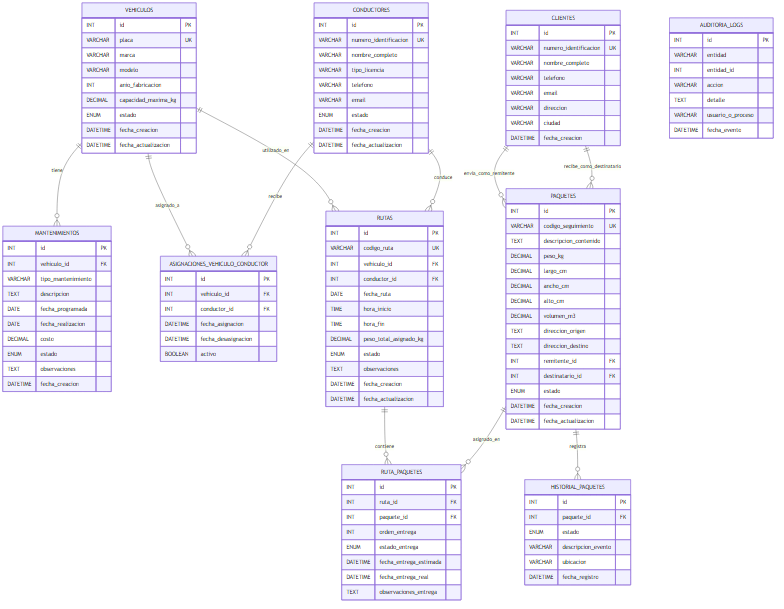

# 🚚 Sistema de Gestión de Flotas y Rutas "RapidExpress"

[](https://www.oracle.com/java/)
[](https://maven.apache.org/)
[](https://www.mysql.com/)
[](#arquitectura-del-sistema)
[](GUIA_DE_USO.md)

---

## 📋 Descripción del Proyecto

**RapidExpress** es un sistema integral de información de backend operado exclusivamente a través de una **Interfaz de Línea de Comandos (CLI)**, desarrollado para automatizar y optimizar la logística de transporte, distribución y mensajería a nivel nacional.

La plataforma resuelve las ineficiencias de los procesos manuales y hojas de cálculo tradicionales, ofreciendo una gestión centralizada y en tiempo real para:
- **Control de Flota de Vehículos:** Registro de especificaciones técnicas, control de capacidades de carga útil en kilogramos y programación de mantenimientos preventivos/correctivos con control de estados.
- **Gestión del Personal de Conducción:** Administración de conductores, control de categorías de licencias, estados contractuales (`ACTIVO`, `DE_VACACIONES`, `INACTIVO`) y asignaciones individuales a unidades motrices.
- **Ciclo de Vida de Paquetes:** Admisión de encomiendas con generación automática de **Tracking ID único**, cálculo volumétrico y trazabilidad cronológica paso a paso vinculando remitentes y destinatarios.
- **Planificación Inteligente de Hojas de Ruta:** Creación de rutas diarias asociando vehículo, conductor y paquetes, incorporando **validación automática contra sobrepeso** (suma de pesos vs. capacidad máxima del vehículo).
- **Monitoreo Concurrente y Registro de Entregas:** Actualización de estados en ruta (`ENTREGADO` o `DEVUELTO`) y liberación automática de vehículos y choferes al finalizar el recorrido.
- **Auditoría y Reportes:** Trazabilidad forense persistente de operaciones críticas (`rapidexpress_audit.log`) y generación de estadísticas de productividad por conductor y vehículo.

> [!TIP]
> Para consultar el manual interactivo completo de opciones, flujos de terminal y ejemplos paso a paso, visita la [📖 Guía de Uso y Wiki Funcional](GUIA_DE_USO.md).

---

## 🛠️ Tecnologías Utilizadas

| Componente / Capa | Tecnología / Herramienta | Versión / Detalle |
| :--- | :--- | :--- |
| **Lenguaje de Programación** | Java SE Development Kit (JDK) | **Java 21 LTS** |
| **Gestor de Construcción** | Apache Maven | **4+** |
| **Motor de Base de Datos** | MySQL Server (Cloud / RDS / Local) | **8.0+** |
| **Conector de Datos** | MySQL Connector/J | **26.7.0** (`com.mysql:mysql-connector-j`) |
| **Patrón de Arquitectura** | MVC + Capa de Servicios + DAO | Capas desacopladas (Presentación, Controladores, Servicios, DAOs) |
| **Interfaz de Usuario** | Consola Interactiva (CLI) | `java.util.Scanner` con validación robusta en `UtilidadConsola` |
| **Persistencia de Auditoría** | Java File I/O (`FileWriter`) | Registro cronológico centralizado en `rapidexpress_audit.log` |
| **Control de Versiones** | Git / GitHub | GitFlow con ramas descriptivas y commits en inglés |

---

## 🗄️ Diseño de la Base de Datos

El almacenamiento y persistencia del sistema está respaldado por una base de datos relacional MySQL normalizada (cumpliendo 3FN), con claves primarias autoincrementales, restricciones de integridad referencial (`FOREIGN KEY` con políticas `RESTRICT` y `CASCADE`), restricciones `CHECK` para magnitudes físicas y campos `ENUM` para asegurar la consistencia de los estados lógicos.

### Entidades Principales del Modelo Relacional:
1. **`vehiculos`**: Parque automotor con placa única, marca, modelo, año (`>= 1990`), capacidad de carga (`> 0 kg`) y estado (`DISPONIBLE`, `EN_RUTA`, `EN_MANTENIMIENTO`).
2. **`conductores`**: Identificación única, nombre completo, licencia, teléfono, correo y estado (`ACTIVO`, `DE_VACACIONES`, `INACTIVO`).
3. **`mantenimientos`**: Historial técnico individual por vehículo, tipo de servicio, fecha programada, fecha de realización, costos y estado de la orden.
4. **`asignaciones_vehiculo_conductor`**: Registro histórico y validación de unicidad para evitar que un chofer opere más de una unidad simultáneamente.
5. **`clientes`**: Directorio de remitentes y destinatarios (vinculación idempotente por documento de identidad).
6. **`paquetes`**: Encomiendas con código de seguimiento único (`TRK-XXXXX`), peso en kg, dimensiones, direcciones de origen/destino y estado (`EN_BODEGA`, `ASIGNADO_A_RUTA`, `EN_TRANSITO`, `ENTREGADO`, `DEVUELTO`).
7. **`historial_paquetes`**: Trazabilidad cronológica de hitos, estados históricos, descripciones y ubicaciones.
8. **`rutas`**: Hojas de ruta diarias con código único (`RUT-XXXXX`), vehículo y conductor asignados, fecha, peso total calculado y estado de avance (`PLANIFICADA`, `EN_PROCESO`, `COMPLETADA`, `CANCELADA`).
9. **`ruta_paquetes`**: Tabla asociativa muchos a muchos entre rutas y paquetes, con orden de parada, estado de entrega (`PENDIENTE`, `ENTREGADO`, `DEVUELTO`) y observaciones.
10. **`auditoria_logs`**: Bitácora en base de datos para respaldo de eventos de negocio y procesos CLI.

### Diagrama Entidad-Relación (ERD)

A continuación se muestra el diagrama relacional de la base de datos:



> [!NOTE]
> Los scripts completos para regenerar la base de datos se encuentran en la carpeta `dabase/`:
> - [1_schema_ddl.sql](dabase/1_schema_ddl.sql): Definición de tablas, índices y restricciones.
> - [2_data_dml.sql](dabase/2_data_dml.sql): Inserción de al menos 20 registros sembrados por entidad principal para pruebas funcionales inmediatas.

---

## 🚀 Instalación y Ejecución

Sigue estos pasos detallados para clonar, configurar la base de datos en la nube y poner en marcha el sistema en cualquier entorno local o servidor.

### 1. Clonar o Descargar el Repositorio
```bash
git clone https://github.com/tu-usuario/rapidexpress.git
cd rapidexpress
```

### 2. Configurar la Base de Datos en la Nube (o Local)

Puedes utilizar cualquier proveedor de base de datos MySQL en la nube (ej. **AWS RDS**, **Clever Cloud**, **Aiven**, **PlanetScale**, **Google Cloud SQL**) o una instancia local de MySQL.

1. **Crear la base de datos**:
   Conéctate a tu servidor MySQL desde tu terminal o cliente gráfico (DBeaver, MySQL Workbench):
   ```sql
   CREATE DATABASE rapidexpress_db CHARACTER SET utf8mb4 COLLATE utf8mb4_unicode_ci;
   USE rapidexpress_db;
   ```
2. **Ejecutar el Script DDL (Estructura)**:
   ```bash
   # Vía cliente mysql en consola:
   mysql -h TU_HOST -P 3306 -u TU_USUARIO -p rapidexpress_db < dabase/1_schema_ddl.sql
   ```
3. **Ejecutar el Script DML (Datos Semilla)**:
   ```bash
   mysql -h TU_HOST -P 3306 -u TU_USUARIO -p rapidexpress_db < dabase/2_data_dml.sql
   ```

### 3. Configurar las Credenciales de Conexión (`db.properties`)

El sistema implementa una arquitectura segura que no expone contraseñas en el código fuente. La clase `ConexionBD` lee las credenciales desde el archivo `db.properties` situado en el submódulo del proyecto (`RapidExpress/RapidExpress/`):

1. Dirígete a la carpeta del proyecto Maven:
   ```bash
   cd RapidExpress/RapidExpress
   ```
2. Copia la plantilla de propiedades:
   ```bash
   # En Windows PowerShell
   Copy-Item "db.properties.example" "db.properties"

   # En Linux / macOS
   cp db.properties.example db.properties
   ```
3. Abre `db.properties` con tu editor preferido y completa tus parámetros de conexión (sin comillas alrededor):
   ```properties
   DB_URL=jdbc:mysql://TU_HOST_NUBE:3306/rapidexpress_db?useSSL=false&serverTimezone=UTC&allowPublicKeyRetrieval=true
   DB_USER=tu_usuario_db
   DB_PASSWORD=tu_contraseña_segura
   ```

> [!CAUTION]
> El archivo `db.properties` está excluido en el `.gitignore`. **Nunca lo incluyas en tus commits.**

### 4. Compilación y Ejecución desde la Terminal

Una vez configurada la base de datos y el archivo `db.properties`, compila y ejecuta el sistema:

#### Modo A: Ejecución con Maven (Recomendado)
```bash
# Dentro de RapidExpress/RapidExpress
mvn clean compile
mvn exec:java
```

#### Modo B: Empaquetado en archivo JAR autónomo
```bash
# 1. Compilar y empaquetar
mvn clean package

# 2. Ejecutar con las dependencias incluidas (Windows PowerShell/CMD)
java -cp "target/RapidExpress-1.0-SNAPSHOT.jar;target/dependency/*" vistas.MenuPrincipal

# En Linux / macOS:
java -cp "target/RapidExpress-1.0-SNAPSHOT.jar:target/dependency/*" vistas.MenuPrincipal
```

---

## 📚 Documentación y Wiki Funcional

Para conocer la operación exhaustiva del sistema desde la terminal, la navegación de menús, las reglas de negocio, las máquinas de estado y un tutorial guiado paso a paso con capturas de consola, consulta:

👉 **[📖 Guía de Uso del Sistema CLI y Wiki Funcional Completa](GUIA_DE_USO.md)**

### Atajos directos a la Wiki:
- [Arquitectura MVC y Flujo de Consola](GUIA_DE_USO.md#1-introducción-y-arquitectura-del-sistema)
- [Mapa de Navegación del Menú Principal](GUIA_DE_USO.md#3-estructura-y-navegación-del-menú-principal)
- [Gestión de Vehículos y Mantenimientos](GUIA_DE_USO.md#41-módulo-1-gestión-de-vehículos-y-mantenimientos)
- [Gestión de Conductores y Personal](GUIA_DE_USO.md#42-módulo-2-gestión-de-conductores-y-personal)
- [Gestión de Paquetes y Trazabilidad](GUIA_DE_USO.md#44-módulo-4-gestión-de-paquetes-y-envíos)
- [Planificación y Despacho de Hojas de Ruta](GUIA_DE_USO.md#45-módulo-5-planificación-y-seguimiento-de-rutas)
- [Diagramas de Máquinas de Estado](GUIA_DE_USO.md#5-diagramas-y-máquinas-de-estados)
- [Tutorial Operativo Extremo a Extremo](GUIA_DE_USO.md#6-tutorial-operativo-extremo-a-extremo-paso-a-paso)
- [Solución de Problemas (Troubleshooting)](GUIA_DE_USO.md#7-diagnóstico-y-resolución-de-problemas-troubleshooting)

---

## 👥 Autores

Proyecto desarrollado por el equipo de ingeniería de software:

- **Jhon Henry Reyes**
- **Sebastian Ayala**
- **Sergio Aparicio**

---

*RapidExpress © 2026 — Plataforma de Gestión Logística de Flotas y Rutas.*
